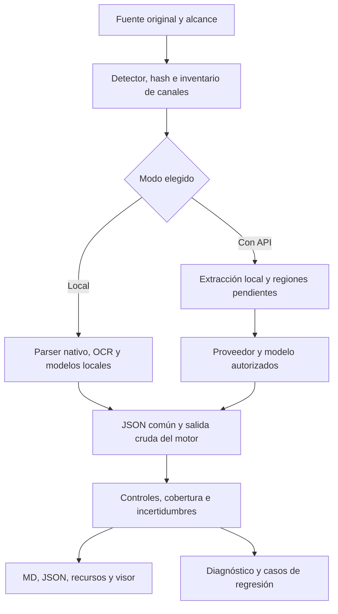

# Sistema MD: investigación, ADN y premortem de los modos Local y API

🛡️ /premortem · **15 huecos consolidados, 0 cerrados en esta investigación; 3 defectos reproducidos.**

Fecha: 2026-09-20. Autoría: Codex, modelo GPT-6 identificado por el entorno; variante exacta no comprobada. Modo: **revisión**, con subagentes de triage, investigación de fuentes y auditoría del código. No es comparación ciega entre modelos. Alcance realizado: lectura del proyecto, documentación oficial, inventario del entorno y controles sintéticos en memoria. No se instalaron motores, descargaron pesos, enviaron documentos a proveedores ni modificó el programa.

Lectura rápida: [decisión](#1-decisión-recomendada-y-objetivo), [huecos](#8-los-15-huecos-y-sus-pruebas-de-cierre), [plan](#15-plan-de-implementación-con-puertas-de-salida), [producto comercial](#17-producto-comercial-ocho-criterios-de-lanzamiento), [capturas y cobertura](#19-contraste-de-las-capturas-y-adn-de-formatos). Ciencia por formato: [ADN_FORMATOS_EXTRACCION.md](ADN_FORMATOS_EXTRACCION.md). Plan para procesamiento: [PLAN_MOTORES_LOCAL_API.json](PLAN_MOTORES_LOCAL_API.json).

## 1. Decisión recomendada y objetivo

**Un solo programa, dos modos visibles: Local y Con API.** Ambos usan la misma memoria, cola, contrato documental, visor, diagnóstico y pruebas. Los motores pesados se ejecutan en procesos y entornos separados. Opcionalmente pueden existir dos accesos directos que abran cada modo; no dos copias del código.

Gerardino confirmó que quiere ambas posibilidades: poder introducir una clave de Gemini, DeepSeek, Claude, GPT o Qwen, y disponer también de un motor local potente. Confirmó **igual prioridad para documentos de obra y libros/artículos** y **distribución/comercialización**. Pidió una interfaz más navegable y estudiar prácticas de Autodesk/Netflix. Se agregan ocho criterios de lanzamiento comercial (sección 17); no son ocho bugs nuevos ni se duplican dentro de los 15 huecos técnicos. Su retroalimentación posterior añade el estudio interno de los formatos y dos capturas de inventario histórico: se contrastan en la sección 19 y en [ADN de formatos](ADN_FORMATOS_EXTRACCION.md).

El objetivo comprobable es conservar información y procedencia, detectar faltantes y señalar incertidumbre. No es defendible prometer cero confusiones para cualquier documento. Una versión mejora cuando corrige casos reproducibles sin perder los que ya resolvía.

**HERMES: COMPLEJA**, por formatos, modelos, dependencias, evaluación y coste de la pérdida silenciosa. Se separa investigación de instalación y piloto. Las estimaciones de rendimiento se obtendrán en el equipo real; no se extrapolan rankings ni consumos históricos de otros modelos.

## 2. Lo que existe hoy: no partir de cero

Raíz del programa auditado: `C:\Users\USUARIO_ORIGEN\Documents\Codex\2026-09-10\realtime-voice-chat\sistema_conversion`.

Antecedente complementario: `C:\Users\USUARIO_ORIGEN\Desktop\CLAUDE CODE\HERRAMIENTAS\SISTEMA_CONVERSION`. Se leyó su historial por tema y el ADN de capas por formato. El motor existente fue portado al programa de Documents; algunas auditorías antiguas que dicen «falta acoplar» ya quedaron superadas.

| Pieza existente | Evidencia y alcance |
|---|---|
| Detección por firma, hashes y originales intactos | `conversion/pipeline.py`, `local_io.py`, README y ACOPLAMIENTO |
| Paquetes MD, JSON, recursos y manifiesto | `documents.py`, `storage.py`; hay JSON desde antes de esta investigación |
| Office/Visio/CAD locales | `native.py`; no equivalen a lectura visual completa ni CAD certificado |
| Excel estructurado | `excel_structure.py`: rangos/tablas y confianza; fórmulas y celdas en CSV de auditoría |
| Lotes locales y asistidos | `batches.py`, `ai_batches.py`: pausa, estado persistente, recuperación y recibos |
| Gemini/DeepSeek API y Gemini/Antigravity CLI | `providers.py`; otros proveedores aún no integrados en el módulo revisado |
| Diagnóstico por firma y recurrencia | `diagnostics.py`; reparación de infraestructura, no autocorrección del contenido |
| Visor HTML local | `visor.py`; controles de recursos externos y navegación |
| Pruebas históricas | README/ESTADO reportan 135 aprobadas al 15-sep. No se repitió esa suite hoy; no se presenta como medición actual |

**Inventario actual del intérprete que resuelve `python`:** Python 3.13.14; MarkItDown 0.1.6; marker-pdf 1.10.2; Torch 2.6.0+cu124; PyMuPDF 1.27.2.3; openpyxl 3.1.5; python-docx 1.2.0; python-pptx 1.0.2; pytesseract 0.3.13. Docling, docling-core y MinerU no se localizaron como distribuciones en ese intérprete. Esto no demuestra ausencia en otros entornos.

`nvidia-smi` informa **RTX 3060, 12288 MiB**. La consulta CIM de RAM física fue denegada: RAM no medida. Tener GPU no prueba compatibilidad ni velocidad de un modelo concreto. La inspección del código actual no encontró adaptadores integrados para los cuatro proyectos investigados.

Se consultaron además `ADN_INTERFAZ_ACCESO.md`, `PREMORTEM_INTERFAZ_ACCESO.md` y las mediciones/plan de motores del 13–14 de septiembre. Documentan navegación Atrás/Adelante, scroll, acceso API/CLI y recibos ya trabajados: la nueva interfaz debe conservarlos. Las mediciones anteriores son evidencia histórica sobre muestras/configuraciones concretas, no un ranking vigente de proveedores ni prueba de los cuatro motores locales. El propio premortem advierte configuración desigual en comparaciones anteriores. No se adoptan como requisitos las propuestas antiguas de rotación de cuentas/claves ni se reabren carencias de lote ya resueltas.

## 3. ADN: la ciencia que necesita cada componente

| Componente | Principio | Ejemplo y prueba necesaria |
|---|---|---|
| Formatos nativos | Leer la estructura donde nació el dato | Fórmula Excel y caché son dos datos; una imagen de la celda no los sustituye |
| PDF/OCR | Texto reconocido, geometría y orden son problemas distintos | Dos columnas pueden tener todas las palabras y estar mezcladas; comprobar relaciones de precedencia |
| Tablas | Estructura y contenido deben conservarse conjuntamente | Encabezado combinado, unidad y valor deben seguir asociados; comprobar celdas y spans |
| Diagramas | El significado incluye nodos, flechas y etiquetas | «A → B si NO» cambia si se pierde NO; comparar grafo y recorte fuente |
| IA visual | Una descripción es una inferencia, no transcripción literal | Separar texto observado, descripción e incertidumbre; nunca completar una cifra ilegible |
| JSON | Un contrato tipado representa datos y relaciones | Una tabla guardada como cadena Markdown no conserva por sí misma las celdas combinadas |
| Markdown | Es vista legible y consultable de la extracción | Derivarlo del JSON común; enlazar evidencia que no cabe en texto |
| Evaluación | El medidor también puede equivocarse | Control sano y control con error conocido antes de juzgar todo un lote |
| Operación | Reanudar exige identidad y resultados durables | Hash fuente + alcance + motor/modelo/configuración; no repetir un envío incierto |

El ADN local consultado cubre extracción por capas, preferencia por el nativo y límites. No certifica las nuevas versiones de motores ni un evaluador universal. Se preserva el idioma original en la extracción; traducción, resumen y análisis serán derivados identificados, nunca sustitutos silenciosos.

## 4. Docling: candidato principal para el primer piloto estructurado

Release observada: **2.129.0**, 18-sep-2026. Propone una representación documental reutilizable, con exportaciones MD/JSON, OCR, tablas, jerarquía y enriquecimientos visuales. Mi recomendación es evaluarlo primero para PDF/imágenes, manteniendo el extractor propio de Excel y las rutas CAD/Visio. Es una selección para pilotar, no una victoria de calidad medida. [Repositorio](https://github.com/docling-project/docling), [release](https://github.com/docling-project/docling/releases/tag/v2.129.0).

`DoclingDocument` conserva elementos, referencias, árbol de lectura y procedencia cuando están disponibles. «JSON sin pérdida» se refiere a su representación extraída: no prueba que el original haya sido extraído íntegramente. Guardar su JSON original además del contrato común permite auditar normalizaciones. [Modelo documental](https://docling-project.github.io/docling/concepts/docling_document/).

Para offline hay que preparar modelos y señalar `artifacts_path`/`DOCLING_ARTIFACTS_PATH`. `enable_remote_services=False` controla servicios remotos de esa opción, pero no constituye por sí solo una prohibición de descargar pesos. El piloto offline requiere entradas locales, activos disponibles y prueba de red. [Opciones avanzadas](https://docling-project.github.io/docling/usage/advanced_options/).

Trampas concretas: su backend Excel usa `data_only=True`, por lo que no sustituye nuestro CSV de expresiones; sus cajas en Excel pueden estar expresadas en índices de celdas, no puntos de impresión. En PPT incluye notas, pero no hay garantía de reconstrucción completa de SmartArt. Office antiguo depende de componentes adicionales como LibreOffice. [Excel etiquetado](https://raw.githubusercontent.com/docling-project/docling/v2.129.0/docling/backend/msexcel_backend.py), [PPT etiquetado](https://raw.githubusercontent.com/docling-project/docling/v2.129.0/docling/backend/mspowerpoint_backend.py), [formatos](https://docling-project.github.io/docling/usage/supported_formats/).

Puede aportar estado parcial, errores, tiempos y confianza. La documentación indica que `table_score` aún no está implementado: no usarlo como certificado de tablas. [Resultado API](https://docling-project.github.io/docling/reference/document_converter/), [confianza](https://docling-project.github.io/docling/concepts/confidence_scores/).

Código MIT; comprobar aparte cada peso. Windows y CPU/GPU están documentados, con restricciones por extra. No se ha medido su RAM/VRAM en esta PC. [Instalación](https://docling-project.github.io/docling/getting_started/installation/), [dependencias de la release](https://raw.githubusercontent.com/docling-project/docling/v2.129.0/pyproject.toml).

## 5. Marker: segunda lectura y candidato especializado

Release observada: **2.0.0**; la instalación local es **1.10.2**. No son intercambiables. La versión actual introduce Surya 2 y backends locales distintos. Ofrece MD, JSON y HTML; opcionalmente incorpora LLM. Lo evaluaría como alternativa para páginas difíciles y comparación, evitando pasar todos los documentos por todos los motores. [Release](https://github.com/datalab-to/marker/releases/tag/v2.0.0), [repositorio](https://github.com/datalab-to/marker).

El JSON actual tiene raíz documental y páginas/bloques con hijos, tipo, HTML, bbox/polígono y jerarquía. Resolver referencias recursivas antes de normalizar. Seleccionar JSON no significa que el comando guarde también MD: el adaptador debe producir ambas vistas desde el resultado o conservar el contrato original. [Renderer](https://github.com/datalab-to/marker/blob/master/marker/renderers/json.py), [guardado](https://github.com/datalab-to/marker/blob/master/marker/output.py).

Surya actual utiliza inferencia local con vLLM/Docker o llama.cpp según dispositivo. Deben prepararse checkpoints, binarios y rutas locales. `use_llm=False` evita el complemento LLM remoto, no todas las posibles descargas iniciales. CPU existe; omitir OCR para ganar velocidad no sirve en escaneos. [Surya](https://github.com/datalab-to/surya), [configuración](https://github.com/datalab-to/surya/blob/master/surya/settings.py).

**No actualizar sobre el Python productivo.** El pyproject consultado exige Torch >=2.7 y Pillow <11; este Python tiene Torch 2.6.0 y MinerU actual requiere Pillow >=11. Son motivos concretos para aislar procesos y dependencias. [Dependencias Marker](https://github.com/datalab-to/marker/blob/master/pyproject.toml), [dependencias MinerU](https://github.com/opendatalab/MinerU/blob/master/pyproject.toml).

Código de la rama actual Apache-2.0; pesos con licencia distinta y restricciones comerciales, incluidos umbrales que pueden considerar al empleador. **La versión instalada 1.10.2 es diferente:** su código declara GPL v3 o posterior y sus pesos contienen condiciones comerciales y sobre productos competidores. No incluir Marker por defecto en una distribución comercial hasta resolver los términos del conjunto exacto. Aislar procesos no elimina obligaciones de licencia. [Código 1.10.2](https://github.com/datalab-to/marker/blob/v1.10.2/LICENSE), [pesos 1.10.2](https://github.com/datalab-to/marker/blob/v1.10.2/MODEL_LICENSE), [pesos rama actual](https://github.com/datalab-to/marker/blob/master/MODEL_LICENSE).

## 6. MinerU: candidato para documentos complejos, con versión fijada

**4.0.0 salió el 16-sep; release visible 4.0.4 del 19-sep.** La arquitectura, CLI y contratos cambiaron. Propuesta: evaluar un tier local adecuado a la RTX 3060, sin asumir que la configuración más pesada sea la mejor. Tiene rutas de PDF/Office y niveles de ejecución con distintos modelos/runtimes. [Releases](https://github.com/opendatalab/MinerU/releases), [tiers](https://opendatalab.github.io/MinerU/usage/tiers/).

Distinguir tres JSON: respuesta de la CLI, representación intermedia y contenido estructurado. `mineru parse --json` no equivale al documento MiddleJson. La documentación define `docvortex.middle`, versión 2.0, y páginas desde cero. `ParseResult.save()` agrupa MD, estructuras e imágenes. El adaptador debe mapear páginas, coordenadas, activos y tipos sin perder la salida cruda. [Contrato de salida](https://opendatalab.github.io/MinerU/reference/output_files/), [SDK](https://opendatalab.github.io/MinerU/usage/sdk_api/).

`MINERU_MODEL_SOURCE=local` permite fallar cuando faltan activos en lugar de descargarlos durante el procesamiento; una orden explícita de descarga tiene otro comportamiento. Desactivar telemetría y posprocesadores remotos para el perfil Local. Diferenciar API documental, endpoint VLM y LLM de posproceso. [Activos y conexiones](https://opendatalab.github.io/MinerU/usage/model_source/), [telemetría](https://github.com/opendatalab/MinerU#telemetry).

Riesgo concreto: la nueva CLI puede operar inicialmente sobre diez páginas según la ruta; fijar explícitamente el alcance y confrontar páginas esperadas/recibidas. Hay documentación con cambios Unreleased: no mezclarla con una release antigua. [Migración](https://opendatalab.github.io/MinerU/reference/migration_4/), [changelog](https://opendatalab.github.io/MinerU/reference/changelog/).

La licencia actual del código incluye condiciones propias; los pesos tienen licencias independientes. El bundle ONNX publica procedencia y hashes. Revisar el conjunto exacto que vaya a empaquetarse, no una etiqueta genérica de «MinerU». [Código](https://github.com/opendatalab/MinerU/blob/master/LICENSE.md), [bundle](https://huggingface.co/opendatalab/MinerU-4_models_onnx), [modelo Pro](https://huggingface.co/opendatalab/MinerU2.5-Pro-2604-1.2B).

## 7. MarkItDown: cobertura ligera y respaldo

Release observada **0.1.7**; local **0.1.6**. Útil para Office/HTML/EPUB y otros formatos ligeros, como ruta selectiva o segunda lectura. La release actual incorpora tablas PDF y matemáticas DOCX; no describirla con capacidades de versiones antiguas. No reemplaza la estructura nativa de Excel ni un parser de diagramas. [Repositorio](https://github.com/microsoft/markitdown), [release](https://github.com/microsoft/markitdown/releases/tag/v0.1.7).

Su resultado normal contiene Markdown y título opcional; guardarlo dentro de JSON sigue siendo una envoltura de texto, sin celdas, bbox y relaciones universales. [Contrato](https://raw.githubusercontent.com/microsoft/markitdown/v0.1.7/packages/markitdown/src/markitdown/_base_converter.py).

**Hallazgo offline comprobado también en nuestra instalación:** `_transcribe_audio.py:48` llama `recognizer.recognize_google(audio)`. Por tanto, archivo local y ausencia de API key no garantizan que una conversión sea offline. No se ejecutó esa llamada. En perfil Local: convertidores permitidos explícitos, plugins y servicios remotos desactivados; audio por ASR local aparte o pendiente. [Código oficial](https://raw.githubusercontent.com/microsoft/markitdown/v0.1.7/packages/markitdown/src/markitdown/converters/_transcribe_audio.py).

PPT puede incluir notas y contenido gráfico compatible, pero no garantiza reconstruir SmartArt; las imágenes necesitan política de conservación. XLSX no devuelve el modelo auditable de expresiones/celdas que ya construimos. [PPT](https://raw.githubusercontent.com/microsoft/markitdown/v0.1.7/packages/markitdown/src/markitdown/converters/_pptx_converter.py), [Excel](https://raw.githubusercontent.com/microsoft/markitdown/v0.1.7/packages/markitdown/src/markitdown/converters/_xlsx_converter.py). Código MIT; dependencias y servicios se inventarían por separado.

## 8. Los 15 huecos y sus pruebas de cierre

Se consolidan causas, no síntomas repetidos. Todos quedan ABIERTOS en este estudio. P0 significa anterior a nuevos adaptadores, P1 necesario para piloto, P2 anterior a distribución amplia.

| ID | Prioridad / estado | Evidencia y consecuencia | Corrección propuesta y cierre |
|---|---|---|---|
| H01 | P0, bug reproducido | `documents.py:121/170`: documento sin `title` y heading nivel 42 pasa `structural_ok`; render lanza `KeyError` | Validar contrato completo antes de publicar. Rechazar ausencias/tipos/niveles incorrectos y conservar control válido |
| H02 | P0, bug reproducido | `native.py:469/475/481`: 2 cajas PPT con texto y un conector dan `slides_flagged=[]`; se pierde la relación sin aviso | Inventario visual independiente del texto y conectores explícitos. Control con diagrama debe preservar relación o marcarla pendiente |
| H03 | P0, bug reproducido | `native.py:94/127`: rama de Excel grande accede a `EmptyCell.column` | Iterar por posición/coordenada segura. Libro con A1/C1 y B1 vacía debe salir sin error, con contenido/fórmulas intactos |
| H04 | P1, brecha de modo | No hay política integral offline para motores nuevos; MarkItDown audio tiene ruta remota | Registro de capacidades, activos preparados, red denegada en control aislado. Cero conexiones salientes; faltante falla de forma clara |
| H05 | P1, integración ausente | Cuatro bibliotecas sin adaptador en el programa; versiones y dependencias incompatibles | Protocolo de worker y entornos aislados. Control conocido por versión/modelo y exportación doble desde una ejecución |
| H06 | P1, contrato parcial | `documents.py:11/92`, `jobs.py:48`: bloques con cadenas MD; Excel tiene estructura adicional | JSON común versionado con tablas/figuras/relaciones y localizadores. Migración de lectura conserva paquetes v1 y normalización registra pérdidas |
| H07 | P1, límite conocido | `pipeline.py:329/341`: texto sin ordenar + PNG; OCR y semántica pendientes | Ruta PDF por página/región: digital, escaneada, mixta, columnas, fórmulas y tabla multipágina. Sin páginas omitidas ni orden roto en controles |
| H08 | P1, canales incompletos | `native.py:195/221/448`, ACOPLAMIENTO: Word/PPT visual, vínculos de imágenes y Office antiguo pendientes | Inventario de canales presentes/extraídos/omitidos; adaptadores nativos + render selectivo. Control con notas/pies/comentarios/SmartArt y legacy |
| H09 | P1, límite de dominio | Visio y CAD requieren relaciones/geometría; los cuatro motores no los sustituyen | Mantener grafo, conectores, unidades, referencias e imágenes. No presentar longitudes aproximadas como metrado certificado |
| H10 | P1, evaluación pendiente | Historial registra falsos positivos del medidor; `semantic=False` en contrato actual | Corpus oro y validadores por familia, con controles sanos/adversos. Medir falsas alarmas y errores no detectados, además de exactitud |
| H11 | P1, diagnóstico parcial | `diagnostics.py:38/113/176`: resolución por evidencia textual; OK global no incorpora por sí mismo fallos abiertos | Separar entorno/ejecución/contenido; paquete de reproducción y prueba enlazada por hash. Recurrencia reabre; no cerrar por texto libre solamente |
| H12 | P1, proveedores parciales | Hay Gemini/DeepSeek y dos CLI; faltan OpenAI/Anthropic/Qwen y ensayos reales de varias rutas | Adaptadores propios, capacidades verificadas por modelo y presupuesto. Control sintético por proveedor y comportamiento correcto con 401/429/timeout/JSON truncado |
| H13 | P1, operación por ampliar | Cola actual persiste, pero faltan política GPU y firmas de los modelos locales nuevos | Un trabajador GPU pesado inicial, backpressure, límites por pieza, caché por configuración y métricas. Corte/reanudación sin duplicar trabajo válido |
| H14 | P2, distribución pendiente | No hay instalador autocontenido ni segunda PC validada; licencias por bundle no resueltas | Manifiesto de versiones/pesos/licencias, doctor funcional y paquete reproducible. Mismo control en segunda PC, offline y sin entorno de desarrollo |
| H15 | P1, catálogo fragmentado | `workflow.py:16/39/133`, `pipeline.py:29/40/50/53`: imágenes y formatos de texto estructurado detectados sin ruta; EPUB queda ZIP; RTF/HTM pueden conservar código bruto como texto. Las skills externas no están integradas | Registro único por familia/subtipo para detector, router, UI, CLI y documentación. Fixtures de extensión disfrazada, EPUB, RTF, XML Excel y TIFF multipágina llegan al adaptador correcto o a pendiente explícito |

H03 se activa en el código normal cuando el archivo supera 30.000.000 bytes comprimidos **o** 120.000.000 expandidos. La reproducción usó un libro mínimo en memoria y forzó únicamente la elección de esa rama: demuestra el defecto del algoritmo, no que se haya convertido un archivo real de 30 MB. H01 prueba el contrato interno; no afirma que todos los puntos externos admitan el mismo documento inválido.

## 9. Diseño del programa único



Local es el valor seguro predeterminado y nunca cambia a API automáticamente. «Con API» también aprovecha los extractores locales: solo envía páginas/regiones que necesitan ayuda, o el alcance explícito que el usuario elija. Un tercer ajuste opcional futuro, «automático con presupuesto», sería una política del mismo programa; no otra aplicación.

Protocolo propuesto de motor: `probe` (capacidad y activos), `convert` (alcance fijo), `normalize`, `cancel`, `healthcheck`. Cada resultado declara capacidades aplicadas/omitidas, páginas recibidas, advertencias y archivos. Registrar `present`, `importable`, `models_ready`, `control_passed`, `offline_verified` por separado.

No mantener cuatro modelos GPU residentes por defecto. Inicialmente un trabajador GPU y extracción ligera en CPU. Primero medir pico de RAM/VRAM y colas; después aumentar concurrencia. Una salida incompleta conserva evidencia y queda parcial; no se concatena con otra «parecida» sin identidad de página/bloque.

## 10. API: elegir proveedor, clave y modelo sin confusiones

La interfaz propuesta solicita **proveedor → clave local → comprobar conexión/capacidad → modelo → alcance/presupuesto**. La clave se guarda mediante el mecanismo seguro del sistema ya existente, fuera de informes y documentos. Un catálogo `/models` solo indica disponibilidad; no prueba visión, límites ni cumplimiento de JSON.

| Opción | Estado / implementación propuesta |
|---|---|
| Gemini | Conector existente; comprobar capacidades y coste de la ruta elegida. Cuotas por proyecto, no asumir una cuota independiente por cada clave. [Límites oficiales](https://ai.google.dev/gemini-api/docs/rate-limits) |
| DeepSeek | Conector existente; mantener prueba de visión por modelo y evidencia fechada. No asumir capacidad visual por compatibilidad de protocolo. [Visión oficial](https://api-docs.deepseek.com/guides/vision/) |
| OpenAI / GPT | Nuevo adaptador, con imágenes y salida estructurada según modelo. JSON con esquema no certifica verdad del contenido. [Visión](https://developers.openai.com/api/docs/guides/images-vision), [salida estructurada](https://developers.openai.com/api/docs/guides/structured-outputs) |
| Anthropic / Claude | Nuevo adaptador de su API y autenticación. Claude Code debe permanecer como conexión de aplicación/CLI distinta de una clave API. [API oficial](https://platform.claude.com/docs/en/api/overview), [suscripción y claves en Claude Code](https://support.claude.com/en/articles/11145838-use-claude-code-with-your-pro-or-max-plan) |
| Qwen | Elegir proveedor/región/modelo; Model Studio documenta compatibilidad OpenAI. Un Qwen de texto no sustituye automáticamente a un Qwen visual. [Compatibilidad oficial](https://www.alibabacloud.com/help/en/model-studio/compatibility-of-openai-with-dashscope) |
| Endpoint compatible o modelo local servido | Perfil avanzado separado; validar transporte, capacidades y destino. Un servidor localhost puede ser local aunque utilice HTTP/API internamente |

La recomendación de modelo será por prueba y tipo documental: coste por unidad **aceptada**, cobertura y tiempo. No fijar «el más potente» por nombre o novedad. Los proveedores no pueden cambiarse silenciosamente tras un timeout: podría haberse consumido cuota. Conservar recibo, respuesta cruda y consumo desconocido; reintento solo con política explícita.

## 11. Markdown y JSON: una fuente estructurada, dos usos

MD: lectura, estudio, navegación y contexto de IA. JSON: integración, búsqueda por campos, auditoría, regeneración de vistas y análisis. El original conserva información que ninguna extracción garantiza recuperar.

Contrato propuesto v2, aún **no activado**:

- Documento: versión de esquema, ID, hash, formato real, idioma y título con procedencia.
- Unidad: página/hoja/diapositiva/layout; alcance esperado y cobertura recibida. Separar número impreso del índice físico.
- Bloque: ID, tipo, texto literal, orden, relaciones y localizador. Para bbox registrar unidades, origen, rotación y transformación; usar null cuando no exista, nunca inventarla.
- Tabla: filas, columnas, celdas, rowspan/colspan, encabezados, continuaciones y ubicación. Valor mostrado, tipo nativo, fórmula y caché son campos distintos.
- Figura/diagrama: activo por hash, pie, anclaje, nodos/conexiones, texto OCR y descripción inferida separados.
- Fórmula: fuente, expresión/LaTeX, representación visual y avisos; conservar el original reconocido aunque haya alternativa corregida.
- Afirmación: `extracted`, `inferred`, `translated` o `human_corrected`, con evidencia. No mezclar corrección semántica con normalización de espacios.
- Ejecución: motor/versión, modelo/revisión/hash de pesos, configuración, prompt, tiempos, memoria y consumo si aplica.
- QA: inventario de canales, controles, incertidumbres, estado estructural y verificación de fidelidad independientes.

Guardar `documento.md`, `document.json`, `verificacion.json`, recursos, salidas crudas y manifiesto. Si una tabla no cabe fielmente en Markdown, enlazar su representación completa; no aplanar spans o perder fórmulas para que «se vea bonito». Excel ya tiene avances reutilizables.

La identidad de caché incluirá fuente, alcance, adaptador, motor, revisión de modelo, configuración relevante, prompt y esquema. Un cambio de cualquiera no sobrescribe la evidencia previa: crea versión. Migración inicialmente de lectura; no reconvertir todos los paquetes existentes.

## 12. Diagnóstico que permita mejorar con evidencia

Tres paneles independientes: **Entorno**, **Ejecución**, **Contenido**. Una instalación sana puede contener documentos pendientes o defectos abiertos. Un documento íntegro puede ser semánticamente erróneo.

Cada fallo debe producir: firma estable; código y fase; fuente/unidad/recorte; hashes; versión de motor/modelo; configuración sin secretos; salida esperada/observada; causa como hipótesis o confirmada; prueba mínima; corrección aplicada; prueba ejecutada y resultado. Las rutas sensibles se redactan cuando el informe se comparte.

Flujo: detectar → clasificar → reproducir → corregir → prueba del fallo y control sano → regresión → nueva versión → reabrir si reaparece. Se conservan los registros actuales; se agrega enlace comprobable al test/evidencia. El programa no debe reescribir su propio código ni reinterpretar originales automáticamente. Claude/Codex pueden revisar el paquete y proponer/aplicar cambios dentro del encargo autorizado.

Reglas semánticas propuestas: números/códigos/unidades; orden de columnas; tablas/celdas/span; flechas y etiquetas; páginas/hojas omitidas; figuras no vinculadas; texto repetido; truncamiento; diferencia entre contenido inexistente e ilegible. El desacuerdo entre dos motores abre revisión: dos motores pueden compartir el mismo error.

Para calibrar, combinar métricas por elemento con hechos verificables. OmniDocBench separa texto, tablas, fórmulas y orden; olmOCR-Bench usa hechos simples para evitar castigar alternativas correctas. Son fundamentos para diseñar nuestra evaluación, no puntajes transferibles al corpus. [OmniDocBench](https://github.com/opendatalab/OmniDocBench), [olmOCR-Bench](https://github.com/allenai/olmocr/blob/main/olmocr/bench/README.md).

## 13. Piloto equilibrado y aceptación

Propuesta: **24 documentos, 12 de obra y 12 de libros/artículos**, hasta 96 unidades seleccionadas inicialmente. Es diseño de muestra, no lote ejecutado. Incluir controles sintéticos y originales permitidos; los casos de evaluación permanecen fuera de ejemplos/prompts y carpetas visibles del motor.

Obra: Excel con fórmulas sin caché/celdas vacías/hojas ocultas, Word con tablas/notas, PPT con flujo/SmartArt, PDF mixto, plano con cajetín rotado, Visio y CAD con unidades. Libros/artículos: PDF digital y escaneado, dos columnas, tabla multipágina, ecuaciones, notas al pie, páginas giradas, EPUB y capítulos largos. Compartir clases no permite que una familia domine la nota global.

Mediciones: cobertura; CER/WER como auxiliares; coincidencia de números/códigos/unidades; estructura y valores de tabla; orden; relaciones de diagramas; fórmulas; precisión/recobrado de alertas del diagnóstico; tiempo p50/p95 cuando la muestra lo permita; RAM/VRAM; invocaciones/tokens reportados; coste por unidad aceptada cuando haya tarifas verificadas.

Aceptación inicial: todos los campos críticos anotados de los controles deben coincidir; ninguna unidad se pierde sin marcar; una duda queda visible; resultados MD/JSON apuntan a la misma evidencia; cero envío externo en Local; claves ausentes de paquetes; pausa/reanudación conserva resultados; error conocido provoca alerta y control sano no es condenado. Esto certifica el alcance del piloto, no todo documento futuro.

La comprensión se comprueba con preguntas cuyas respuestas están anotadas y solo usando derivados. Complementa la revisión de canales; cinco respuestas correctas no demuestran que no falte una tabla.

## 14. Premortem F1–F4

Grafo: fuente → detector → parser/modelo → normalizador → evaluador → publicación → consulta. Dependencias transversales: activos/entorno, cola, disco, GPU y proveedor. Nodos históricos pertinentes: `[[pc-luz]]`, `[[disco-c]]`, `[[estado-md]]`; el grafo del motor externo identifica además cuota e índice. Referencias históricas no prueban recurrencia actual de hardware.

| Escenario y causa estructural | Banda / impacto 1–5 | Primaria, plan B y prueba de cierre |
|---|---|---|
| MD legible pierde flecha, cifra o imagen; el validador solo mira forma | Recurrencia histórica documentada; 5 por afectar decisiones basadas en documentos | Inventario y QA por canal; B: revisión del recorte. Cierre con H02 y controles de contenido |
| El propio evaluador rechaza trabajo correcto; patrón único para formatos distintos | Repetido en historial; 4 por reconversión inútil y falsa confianza | Controles sanos/adversos y métricas separadas; B: revisar etiqueta oro. No atribuir porcentaje sin muestra |
| «Local» envía audio o descarga pesos; localidad confundida con ausencia de clave | Ruta remota observada, frecuencia de ejecución no medida; 4 | Allowlist y prueba aislada sin red; B: capacidad deshabilitada con aviso, sin fallback remoto |
| Nuevo motor actualiza librerías y rompe el programa | Conflicto Pillow observado; recurrencia local no medida; 4 | Entornos/workers; B: versión anterior. Control de arranque y conversión por motor |
| Modelo remoto cambia o timeout deja consumo incierto | Antecedentes documentados; 4 | Capacidad probada, recibo durable y pausa; B: continuar trabajo local independiente. No reintentar cambiando cuenta |
| Se corta proceso o falta VRAM y se vuelve a empezar | Riesgo de integración, sin tasa actual; 4 | Unidad durable y concurrencia limitada; B: menor lote/CPU si pasa control. Inyectar caída en fixture |
| JSON de motor cambia y el adaptador pierde páginas | Cambio mayor MinerU observado; 5 por omisión silenciosa | Pin de versión y fixtures de contrato; B: conservar salida cruda y rechazar publicación. Comparar cobertura explícita |
| Distribución funciona solo aquí o incluye pesos no aptos para el uso | Sin ensayo segunda PC; uso comercial confirmado; 4 | Manifiesto y prueba física; B: núcleo ligero sin ese motor. Licencia y ejecución verificadas antes de incluir bundle |

Cadena causal principal: confianza falsa ← salida legible ← se comprueba archivo/esquema, no canales ← falta referencia anotada por formato ← se define éxito como «convertir» sin precisar qué información debe sobrevivir. La corrección central es el contrato de información y su medición.

Responsables propuestos: desarrollo/correcciones, Codex en la siguiente fase; referencias de verdad, revisión conjunta con Gerardino; autenticación y elegibilidad empresarial, usuario/organización; comportamiento de motores, validación local del adaptador. Ningún escenario se marca cerrado solo por tener una solución escrita.

## 15. Plan de implementación con puertas de salida

| Fase | Entregable concreto | Ciencia y condición para avanzar |
|---|---|---|
| F1 — estabilizar | Corregir H01–H03 y agregar sus regresiones | Contratos y tipos; controles sanos/adversos pasan y suite existente sin regresiones |
| F2 — contrato/doctor | JSON v2 propuesto, catálogo ejecutable de formatos y canales, migración de lectura, diagnóstico con estados separados | Representación y procedencia; fixtures v1 siguen legibles, todas las referencias resuelven y el router coincide con la cobertura publicada |
| F3 — Local inicial | Worker Docling aislado + extractores nativos; MarkItDown selectivo | OCR/estructura y operación offline; piloto equilibrado, cero egress y recursos medidos |
| F4 — candidatos locales | Comparar Marker y MinerU en las clases donde Local inicial falla | Experimento controlado; elegir por calidad/coste local, dependencias y licencia, sin convertir cuatro veces todo |
| F5 — API ampliada | Presets Gemini/DeepSeek/OpenAI/Anthropic/Qwen y comprobación de capacidades | Protocolos, auth y presupuesto; pruebas simuladas y luego control real autorizado por proveedor |
| F6 — calidad continua | Casos oro, paquetes de fallo, panel de revisión y comparación de versiones | Evaluación calibrada; defectos no se cierran sin prueba y recurrencia se reabre |
| F7 — distribución | Instalador o paquetes modulares, dos accesos opcionales, segunda PC y documentación | Reproducibilidad; arranque y canario con/sin GPU, activos/licencias identificados |

No hay fecha ni presupuesto API confirmado. Primero F1–F2, sin servicios externos; después estimar descarga, disco y duración de F3 con el bundle concreto. No justificar instalar cuatro motores simultáneamente por amplitud del objetivo.

**GCAO de continuación:** Generar un único programa Local/API sobre el núcleo existente; Capturar todos los canales requeridos con procedencia y dudas; Acumular JSON canónico, salidas crudas, MD y casos de fallo versionados; Output: conversión verificable, diagnóstico reproducible y piloto equilibrado obra/biblioteca.

## 16. Límites del estudio y siguiente acción

Se verificaron fuentes, código y entorno; se reprodujeron tres defectos en memoria. No se ejecutaron los nuevos motores ni la suite completa, no se midió calidad/velocidad en los 24 documentos y no se comprobó login/saldo de proveedores. Las releases enlazadas a ramas móviles requieren fijar commit/paquetes en el piloto. El plan JSON adjunto describe propuestas; no es configuración activa.

Siguiente paso concreto recomendado: **F1, corregir los tres defectos reproducidos y sus pruebas**, conservando originales y paquetes. Después F2 define el contrato que recibirán los motores. El uso comercial ya está confirmado: revisar licencias del núcleo actual antes de elegir qué motores entrarán al instalador.

## 17. Producto comercial: ocho criterios de lanzamiento

La investigación de producto usa documentación pública; no presume conocer arquitectura, secretos ni controles internos de Autodesk o Netflix. «Que no falte nada» se traduce a una matriz mantenible de requisitos, riesgos y evidencias, no a una garantía de exhaustividad. Windows será el primer destino propuesto por el entorno existente; otros sistemas requieren su propio piloto.

### C01. Licencias y componentes distribuibles

Crear SBOM con paquetes transitivos, binarios, pesos, fuentes, hashes, licencias y atribuciones. Resolver distribución de la aplicación y de cada motor por separado. **PyMuPDF ya está en el programa y usa licencia dual AGPL/comercial**: para un producto cerrado hay que evaluar la licencia comercial o una alternativa compatible y volver a probar el render/extracción. AGPL no equivale a prohibición de cobrar; las obligaciones dependen de la distribución elegida. [PyMuPDF oficial](https://pymupdf.readthedocs.io/en/latest/faq/index.html).

La licencia exacta de Marker se documenta en §5. MinerU cambia por versión y pesos: no usar la licencia de un modelo Pro para justificar otro bundle. Docling/MarkItDown MIT no convierte todas sus dependencias en MIT. ODA File Converter está instalado como aplicación auxiliar: no hay evidencia en esta investigación de derechos para redistribuir ese ejecutable dentro de nuestro instalador; los SDK tienen sus propias condiciones. [ODA utilidades](https://www.opendesign.com/faq/question/what-are-oda-viewer-and-oda-file-converter), [licenciamiento SDK](https://www.opendesign.com/pricing).

**Aceptación:** lista exacta del instalador con derechos/obligaciones resueltos por versión; ningún peso se incluye solo porque es descargable. Decisión comercial pendiente: cerrado, abierto o combinación con componentes/licencias comerciales. La revisión de obligaciones del producto final requiere confirmación competente; este estudio identifica condiciones documentadas, no emite una autorización jurídica.

### C02. Navegación y revisión como núcleo del producto

AutoCAD documenta recientes, fijados, lista/cuadrícula, búsqueda y orden. Windows recomienda navegación estable y lista/detalle. Aplicación: **Inicio, Biblioteca, Cola, Revisar, Motores e IA, Diagnóstico**; recuperar filtros, selección y documentos abiertos. Priorizar trabajo y resultados sobre tarjetas decorativas. [AutoCAD](https://help.autodesk.com/cloudhelp/2025/ENU/AutoCAD-WhatsNew/files/GUID-3EB7B2CB-C04B-4F24-AE5E-0EC8CDA37728.htm), [navegación Windows](https://learn.microsoft.com/en-us/windows/apps/design/basics/navigation-basics).

Dentro del documento: original o recorte a la izquierda; Lectura/MD/JSON a la derecha; unidad y bloque enlazados; panel de dudas con acción concreta. La comparación sincronizada solo se ofrece donde exista correspondencia. Para tablas grandes usar virtualización/paginación de vista conservando datos, búsqueda y exportación completa. Para libros: árbol de capítulos, navegación y búsqueda contextual. Para obra: hojas, planos, códigos, revisión y procedencia.

**Aceptación:** un usuario puede agregar un archivo, interpretar progreso, abrir resultado, localizar una duda, volver a la fuente y exportar MD/JSON sin instrucciones del desarrollador. Probar teclado, Narrador, alto contraste y escalados; no codificar estado solo con color. [Accesibilidad Windows](https://learn.microsoft.com/en-us/windows/apps/develop/accessibility).

La interfaz actual fue inspeccionada en código, no evaluada visualmente con usuarios en esta sesión: Tkinter/ttk, cuatro pestañas y progreso indeterminado. La maqueta nueva es exploración, no implementación ni prueba de usabilidad. Mantener el núcleo Python independiente de la futura interfaz; evaluar PySide/Qt, Tauri u otra opción con requisitos reales antes de decidir el stack y sus licencias.

### C03. Progreso honesto y recuperación

Mostrar fase, unidad actual, unidades completas, transcurrido, estado del motor y qué se conservó. Porcentaje solo con denominador conocido; no inventar tiempo restante. La interfaz debe continuar navegable. Cancelar detiene con política explícita y conserva trabajo; pausa se ofrece solo donde exista checkpoint real. [Progreso Windows](https://learn.microsoft.com/en-us/windows/apps/develop/ui/controls/progress-controls).

Error accionable: «No se pudo leer la página 18; se conservaron 17. Abrir original / Ver detalle / Reintentar con alcance explícito». Error y parcial no significan lo mismo. [InfoBar](https://learn.microsoft.com/en-us/windows/apps/develop/ui/controls/infobar).

**Aceptación:** inyectar fallo en una página de fixture y cierre del worker; se conserva lo completo, no se duplica lo facturable y el usuario puede localizar lo pendiente. Coste desconocido no se convierte en cero.

### C04. Instalación y actualización con identidad

Autodesk publica administración de versiones, extensiones y despliegues; Access centraliza actualizaciones. Adaptación: motor, modelos y aplicación separados, manifiestos de compatibilidad y avisos de tamaño/licencia antes de descargar. MSIX es candidato sujeto a compatibilidad COM/runtimes, no una elección ya aplicada. [Despliegues Autodesk](https://www.autodesk.com/support/download-install/admins/account-deploy/deploy-from-autodesk-account), [manifiestos de plugins](https://help.autodesk.com/cloudhelp/2026/ENU/AutoCAD-Customization/files/GUID-BC76355D-682B-46ED-B9B7-66C95EEF2BD0.htm).

Firma del editor, sello de tiempo, hashes y validación antes de activar; actualizaciones fuera de trabajos activos; rollback controlado y migraciones de datos reversibles o con respaldo. Firma no garantiza ausencia de bugs ni reputación SmartScreen inmediata. [Firma MSIX](https://learn.microsoft.com/en-us/windows/msix/package/sign-msix-package-guide), [actualizaciones](https://learn.microsoft.com/en-us/windows/msix/app-installer/update-settings).

**Aceptación:** instalación limpia en segunda PC, paquete manipulado rechazado, corte durante actualización recuperable, editor visible, documentos/configuración preservados, desinstalación con elección explícita sobre datos del usuario. Núcleo arranca sin descargar modelos que no se necesitan.

### C05. Amenazas de documentos y separación de procesos

Mapear documento → parser → modelo → normalizador → visor, más claves, COM, actualizador y posible servidor local. Documentos y salidas de IA son datos sin permiso para ejecutar herramientas, macros o instrucciones. Ampliar los controles ya existentes de firma, ZIP y CSP: rutas de escape, enlaces/symlinks, XML expansivo, límites de memoria/tiempo/píxeles, recursos externos y archivos dañados. Procesos/venv separados son aislamiento de fallos/dependencias, **no sandbox de seguridad del sistema operativo**. [OWASP amenazas](https://cheatsheetseries.owasp.org/cheatsheets/Threat_Modeling_Cheat_Sheet.html), [archivos](https://cheatsheetseries.owasp.org/cheatsheets/File_Upload_Cheat_Sheet.html), [instrucciones maliciosas](https://cheatsheetseries.owasp.org/cheatsheets/LLM_Prompt_Injection_Prevention_Cheat_Sheet.html).

**Aceptación:** corpus sintético adverso no ejecuta macros, no escribe fuera del destino, no carga URLs ocultas y no derriba el proceso de interfaz. Cada worker opera con permisos mínimos y límites comprobados; si se utiliza HTTP local, autenticación/origen/puerto y autorización de rutas deben probarse. No se cambió seguridad de Windows durante este estudio.

### C06. Claves, privacidad y licencia de la aplicación

BYOK: claves por usuario mediante Credential Manager/DPAPI, nunca en proyectos, logs, prompts, línea de comandos o paquete de soporte. Borrar/reemplazar credencial debe ser visible. DPAPI protege almacenamiento, no todo proceso comprometido del mismo usuario. [DPAPI](https://learn.microsoft.com/en-us/windows/win32/api/dpapi/nf-dpapi-cryptprotectdata), [gestión de secretos](https://cheatsheetseries.owasp.org/cheatsheets/Secrets_Management_Cheat_Sheet.html).

Separar cuatro políticas: envío documental, telemetría, actualizaciones y activación de licencia. Autodesk documenta conectividad inicial y periodos offline para ciertas licencias; eso es una referencia de comunicación, no la política que debamos copiar. Si ofrecemos trabajo permanentemente desconectado, una licencia firmada local y paquetes offline son alternativas, con revocación más lenta y soporte más difícil. Ningún DRM local es invulnerable. [Autorización Autodesk](https://www.autodesk.com/support/account/admin/licensing-faq/authorization).

**Aceptación:** clave señuelo ausente de exportaciones/diagnóstico; usuario ve quién recibe qué; conversión Local funciona con red denegada bajo la política contratada; ninguna telemetría documental oculta. Definir retención/borrado de temporales, exportación y privacidad antes de vender. No recolectar documentos para mejorar el producto sin una autorización separada.

### C07. Resiliencia y soporte basados en evidencia

Netflix publica patrones de timeouts, aislamiento de recursos, interrupción temporal de servicios fallidos, observabilidad y experimentos controlados. Hystrix está en mantenimiento: adoptar principios, no agregarlo como nueva dependencia. Para escritorio sirven workers limitados, cola durable, healthchecks, proveedores desacoplados y pruebas de corte con fixtures. [Hystrix](https://github.com/Netflix/Hystrix), [funcionamiento](https://github.com/Netflix/Hystrix/wiki/How-it-Works), [Atlas](https://netflix.github.io/atlas-docs/overview/).

Paquete de soporte mínimo y revisable: ID de trabajo, versiones, fase, tiempos, memoria y código de error; sin texto de documentos/secretos por defecto. Incorporar disclosure de vulnerabilidades, versiones soportadas, registro de cambios y proceso de corrección. La telemetría local puede existir sin telemetría remota. [Logging OWASP](https://cheatsheetseries.owasp.org/cheatsheets/Logging_Cheat_Sheet.html).

**Aceptación:** soporte distingue falta de modelo, error parser, GPU y API con un paquete saneado; fallo no se propaga a toda la cola. Antes de activar una corrección, pasan regresiones y se conserva versión anterior recuperable.

### C08. Lanzamiento medible y alcance comercial

Primera versión comercial candidata: Windows, documentos individuales/carpetas, núcleo Local probado, BYOK por proveedores habilitados, MD/JSON, biblioteca/revisión, diagnóstico y actualización firmada. Audio/video, colaboración multiusuario, facturación integrada, marketplace y sincronización cloud son ampliaciones con validación propia; no se anuncian como soportadas solo por existir una dependencia.

Definir edición/licencia de la aplicación, costes propios de soporte y distribución de modelos, garantía de compatibilidad y política offline. BYOK significa que el cliente paga directamente el consumo de su proveedor cuando corresponda; no mezclar ese gasto con nuestra licencia. Disponibilidad de adaptadores no garantiza disponibilidad mundial de todos los proveedores.

**Aceptación:** matriz pública por versión de formatos/subtipos/limitaciones, prueba de segunda PC y usuarios, SBOM aprobado, controles de seguridad y recuperación, política de privacidad/licencia/actualización documentada y resultados del piloto equilibrado. Estas puertas refinan H04–H14; no se cuentan como defectos adicionales descubiertos en el código.

## 18. Orden revisado para comercialización

1. **Estabilizar y decidir componentes distribuibles:** H01–H03 + inventario de licencias del núcleo actual. Sin descargar modelos nuevos.
2. **Contrato y experiencia:** JSON común, estados de calidad y prototipo Biblioteca/Cola/Revisar. Validar tareas con Gerardino y usuarios de prueba.
3. **Piloto Local equilibrado:** Docling como candidato inicial más rutas nativas; 12 documentos de obra y 12 de biblioteca, alcance acotado. Marker/MinerU opcionales tras licencia y prueba.
4. **BYOK ampliado y diagnóstico:** proveedores con capacidades verificadas, presupuesto, evidencia, pruebas de error y privacidad.
5. **Producto distribuible:** installer/actualizaciones firmados, licencias exactas, seguridad de workers, segunda PC y pruebas de uso.
6. **Mejora continua:** datos de fallos consentidos y saneados, regresiones, nuevas versiones y evaluación antes de ampliar promesas.

La investigación entrega un plan revisable y una maqueta interactiva. No entrega aún un producto comercial instalado ni una auditoría de seguridad completa. El siguiente bloque ejecutable sigue siendo estabilización del núcleo y sus pruebas.

## 19. Contraste de las capturas y ADN de formatos

El usuario aportó dos capturas con un inventario de 24 extensiones repartidas entre motor de lotes, visor, skills de extracción y otra herramienta Excel. Son antecedentes, no pruebas actuales del programa. Se contrastaron tres raíces: **A**, aplicación de Documents indicada en §2; **B**, motor antecedente de `Desktop/CLAUDE CODE/HERRAMIENTAS/SISTEMA_CONVERSION`; **C**, `Desktop/CLAUDE CODE/HERRAMIENTAS/EXTRACCION LIBROS/extraer.py`.

| Familia | Hecho comprobado en código | Consecuencia para el plan |
|---|---|---|
| PNG/JPG/TIFF sueltos | A los detecta (`pipeline.py:29`), pero `workflow.py:39/133` no tiene conversión. B tampoco los convierte. C aplica OCR | Integrar adaptador real; distinguir texto OCR de comprensión visual |
| BMP/WebP/GIF | A no tiene firmas específicas. C incluye BMP/WebP, no GIF. B detecta GIF sin convertir | Catálogo por subtipo, fotogramas/páginas y límites; no publicar soporte por asociación |
| EPUB | A detecta ZIP sin reconocer su paquete (`pipeline.py:40`); B puede excluirlo como no documental; C llama a MarkItDown | Examinar `mimetype`, contenedor y spine antes de excluir ZIP |
| HTML/HTM | A reconoce `.html` pero queda pendiente; `.htm` puede caer como texto bruto UTF-8 | Unificar identificación y parser DOM; render opcional separado |
| TXT/MD | A sí tiene `convert_text()` (`pipeline.py:173`); no importa recursos externos | Conservar texto y declarar alcance de enlaces/activos |
| CSV/JSON/XML | A identifica extensiones (`pipeline.py:53`), pero no las enruta a extracción especializada | Parsers de datos con tipos/localizadores, no solo envolver una cadena en JSON |
| RTF | A puede clasificar RTF ASCII como texto y guardar códigos; B lo identifica sin convertir; C no lo declara | Parser RTF y estado pendiente hasta extracción real |
| DOC/XLS/PPT | A detecta OLE/legacy; no integra conversión. B identifica variantes sin procesarlas | Parser binario o conversión controlada de copia; macros/vínculos inactivos |
| Excel XML plano | B lo detecta, pero `convertir.py:219/683` lo copia a `.xlsx` y usa openpyxl; A no tiene ruta específica | Cambiar extensión no transforma XML en ZIP. Incompatibilidad observada por código, no reproducida en ejecución |

El conjunto declarado por C contiene **19 extensiones**, incluyendo sinónimos. No son 19 familias ni rutas disponibles dentro de A. La búsqueda en `A/conversion/*.py` no encontró integración de C, MarkItDown, pymupdf4llm o Tesseract. Una skill que apunta a otro script no conecta automáticamente sus capacidades con el producto.

**Límites que no deben confundirse:**

- B describe hasta 12 imágenes Excel (`convertir.py:686`), 20 imágenes Word (`:706`) y 20 diapositivas marcadas visuales (`:732`); el último tope limita descripciones, no el render previo de todas las diapositivas. Hay exclusiones como EMF y errores que se saltan. Son topes del antecedente, no cobertura de A.
- B recortaba MD a 400 filas con datos por hoja (`:263`), con aviso; A eliminó ese recorte. No reabrir ese hueco antiguo como si continuara vigente.
- A rechaza preparar más de 20 páginas PDF por selección (`pipeline.py:304`), en vez de recortar silenciosamente. Su lote de 20 archivos por ejecución predeterminado admite 1–200 y se reanuda (`batches.py:119`). No son topes de figuras por documento.
- C muestrea hasta 20 páginas para decidir OCR (`extraer.py:68`); la decisión por promedio puede fallar en documentos mixtos. No significa que solo extraiga 20 páginas. Su OCR de imagen no recorre los directorios de TIFF (`:92`). Ambos límites amplían H07.
- A extrae medios Excel con una lista de tipos internos que no incluye TIFF/BMP/WebP (`native.py:188`). Amplía H08. El criterio `md_valido()` de B comprueba forma, no cobertura completa de descripciones (`convertir.py:600/774`): amplía H10.

**ADN incorporado:** el documento complementario estudia 18 grupos, incluyendo contenedores y familias adicionales propuestas. No son 18 formatos certificados. Cada ficha identifica cómo está fabricado el archivo, qué canales deben sobrevivir, parser/render/OCR/visión pertinentes, caso testigo y condición de cierre. Incluye un hueco documental explícito: recuperar/validar la referencia técnica histórica de Excel XML 2003 antes de implementar su adaptador.

La arquitectura conserva el núcleo Python y evalúa TypeScript para la experiencia de escritorio. Java/Tika es opcional para cobertura legacy; no se agrega un lenguaje por amplitud de la lista. La corrección principal es conocer los datos y medir pérdidas, no acumular motores.

## 20. Evidencia reproducible de H01–H03

Los controles se ejecutaron en el intérprete indicado en §2, con importación del código auditado y documentos mínimos en memoria. `python -B` evitó escribir bytecode; no se leyeron nativos del usuario ni se llamaron API. Código de reproducción para una ejecución posterior desde la raíz A:

```python
import io, json, zipfile
from unittest.mock import patch
from conversion.documents import validate, render
from conversion import native
from pptx import Presentation
from pptx.util import Inches
from pptx.enum.shapes import MSO_SHAPE, MSO_CONNECTOR
import openpyxl

bad = {'schema_version': 1, 'expected_units': [1], 'units': [
    {'number': 1, 'blocks': [{'id': 'b', 'kind': 'heading', 'level': 42, 'text': 'Texto'}]}]}
qa = validate(bad)
try:
    render(bad, qa)
    rendering = 'OK'
except Exception as exc:
    rendering = type(exc).__name__ + ': ' + str(exc)
print(json.dumps({'test': 'contrato incompleto',
                  'structural_ok': qa['structural_ok'], 'render': rendering}))

pr = Presentation()
slide = pr.slides.add_slide(pr.slide_layouts[6])
for x, text in [(1, 'Inicio'), (4, 'Aprobado')]:
    shape = slide.shapes.add_shape(MSO_SHAPE.RECTANGLE, Inches(x), Inches(1), Inches(2), Inches(1))
    shape.text = text
slide.shapes.add_connector(MSO_CONNECTOR.STRAIGHT, Inches(3), Inches(1.5), Inches(4), Inches(1.5))
buffer = io.BytesIO()
pr.save(buffer)
raw_ppt = buffer.getvalue()
with patch.object(native, 'open', lambda *a, **k: io.BytesIO(raw_ppt), create=True), \
     patch.object(native.os, 'makedirs'):
    md, count, flagged = native.pptx_texto('memory.pptx', 'memory')
print(json.dumps({'test': 'flujo PPT dos cajas y conector', 'count_visual': count,
                  'slides_flagged': list(flagged), 'text': md}, ensure_ascii=False))

wb = openpyxl.Workbook()
ws = wb.active
ws['A1'], ws['C1'] = 'A', 'C'
buffer = io.BytesIO()
wb.save(buffer)
raw_xlsx = buffer.getvalue()
OriginalZip = zipfile.ZipFile
def mem_open(path, mode='r', **kwargs):
    return io.BytesIO(raw_xlsx) if 'b' in mode else io.StringIO()
def mem_zip(path, *args, **kwargs):
    return OriginalZip(io.BytesIO(raw_xlsx), *args, **kwargs) if isinstance(path, str) else OriginalZip(path, *args, **kwargs)
try:
    with patch.object(native, 'open', mem_open, create=True), \
         patch.object(native.os, 'makedirs'), \
         patch.object(native.os.path, 'getsize', return_value=31_000_000), \
         patch.object(zipfile, 'ZipFile', mem_zip):
        native.excel_tres_capas('memory.xlsx', 'memory')
    outcome = 'OK'
except Exception as exc:
    outcome = type(exc).__name__ + ': ' + str(exc)
print(json.dumps({'test': 'Excel streaming con hueco B1 y rich=False simulado', 'outcome': outcome}, ensure_ascii=False))
```

Salida observada:

```jsonl
{"test": "contrato incompleto", "structural_ok": true, "render": "KeyError: 'title'"}
{"test": "flujo PPT dos cajas y conector", "count_visual": 1, "slides_flagged": [], "text": "## Diapositiva 1\nInicio\nAprobado\n"}
{"test": "Excel streaming con hueco B1 y rich=False simulado", "outcome": "AttributeError: 'EmptyCell' object has no attribute 'column'"}
```

El proceso devolvió 0 porque el control captura excepciones para registrarlas; **no significa que las conversiones fueran correctas**. No se repitieron estos controles tras cambios, porque no se aplicaron correcciones al programa. Los hashes de archivos auditados se incluyen en el plan JSON para detectar cambios futuros.
