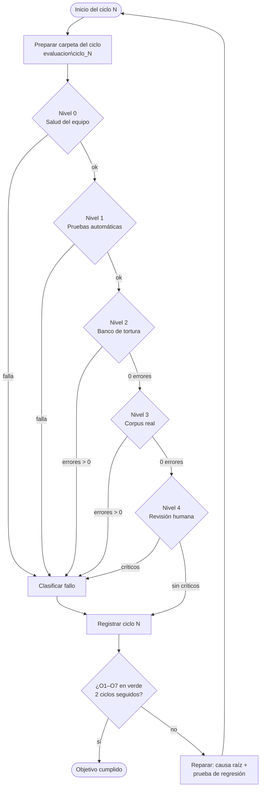

# Loop de evaluación de Sistema MD

Ciclo **repetible** para comprobar, con evidencia, que Sistema MD cumple su objetivo en tu PC y
con **tus** archivos reales, no solo con los sintéticos del banco de tortura. Cada vuelta termina
con una decisión escrita: **cerrar** (objetivo cumplido) o **reparar y repetir**.

> Todos los comandos son de **PowerShell**, ejecutados en la carpeta del programa:
> `cd "C:\Users\ECHEVERRIA IZQUIERDO\Pagina_referencia\Sistema_MD"`.
> Requisito previo: `py -3.12 .\preparar_equipo.py --instalar` terminado con «Núcleo preparado».

---

## 1. El objetivo, en criterios que se pueden medir

| Id | Objetivo | Se cumple cuando… | Se mide en |
|---|---|---|---|
| **O1** | Instala y arranca | `--check` da `"ok": true` y la interfaz abre con doble clic | Nivel 0 |
| **O2** | El código no retrocede | Las pruebas automáticas pasan (0 FAIL, 0 ERROR) | Nivel 1 |
| **O3** | Indestructible | 0 excepciones crudas, caídas o timeouts; todo archivo dañado se rechaza **con causa** | Niveles 2 y 3 |
| **O4** | Markdown válido | Validador con **0 errores** (tablas, UTF-8 sin BOM, enlaces, ruido) | Niveles 2 y 3 |
| **O5** | Nada se pierde en silencio | Todos los marcadores `debe_contener` de tus archivos aparecen | Nivel 3 |
| **O6** | Fiel al original | Revisión humana por muestra sin errores **críticos** (valor, número o fórmula cambiados) | Nivel 4 |
| **O7** | Cubre tus formatos | Cada familia que usas tiene ≥ 5 archivos reales convertidos (DWG incluido) | Nivel 3 |

**Objetivo cumplido (salida del loop):** O1–O7 en verde durante **2 ciclos seguidos**, sin
cambios de código entre ambos salvo documentación.

---

## 2. Flujo



Regla del flujo: **no se salta un nivel**. Si el Nivel 1 falla, no tiene sentido evaluar tus
archivos: primero se repara. Un fallo se registra siempre, aunque parezca menor.

---

## 3. Preparación (una vez por ciclo)

```powershell
$ciclo = "ciclo_01"                                   # cambia el número en cada vuelta
New-Item -ItemType Directory -Force "evaluacion\$ciclo" | Out-Null
git log --oneline -1 | Out-File "evaluacion\$ciclo\version.txt"   # qué versión evalúas
```

La carpeta `evaluacion\` **no se sube a GitHub** (está en `.gitignore`): ahí van tus documentos
reales y sus resultados.

### Corpus real (solo la primera vez; luego se amplía)

Crea `evaluacion\corpus\` y copia **archivos reales de tu trabajo** — mínimo 5 por familia que uses:

| Familia | Incluye sobre todo… |
|---|---|
| Excel `.xlsx/.xlsm/.xls/.xlsb` | presupuestos con fórmulas, hojas ocultas, tablas anchas, celdas combinadas |
| Word `.docx/.doc` | informes con tablas, notas al pie, listas, imágenes |
| PowerPoint `.pptx/.ppt` | presentaciones con tablas, notas del orador, diagramas |
| PDF | uno digital, uno escaneado, uno a dos columnas, uno con tablas |
| CAD `.dwg/.dxf` | planos reales de versiones distintas de AutoCAD |
| Imágenes `.png/.jpg/.tiff` | fotos de documentos, capturas, un TIFF de varias páginas |
| Dañados | un archivo cortado, uno vacío, uno con extensión cambiada |

Después crea `evaluacion\corpus\esperado.json`. Para **cada** archivo di qué debe pasar y escribe
2–4 frases o números **que sabes que están en el original** (copiados tal cual):

```json
{
  "presupuesto_obra.xlsx": {"familia": "excel", "esperado": "convertir",
                            "debe_contener": ["Cemento Portland tipo I", "1250", "Metrado final"]},
  "informe_mensual.docx":  {"familia": "word", "esperado": "convertir",
                            "debe_contener": ["Resumen ejecutivo", "texto de una nota al pie"]},
  "plano_planta.dwg":      {"familia": "cad", "esperado": "convertir",
                            "debe_contener": ["TABLERO TG-01"]},
  "copia_cortada.xlsx":    {"familia": "corrupto", "esperado": "rechazo_controlado"}
}
```

Esos marcadores son la prueba de **O5**: si una frase del original no llega al Markdown, el
validador lo marca como error `F1`. Elige frases de sitios difíciles: una nota al pie, una hoja
oculta, una tabla dentro de otra, el texto de un plano, un número de una imagen.

---

## 4. Niveles del ciclo

### Nivel 0 · Salud del equipo → **O1**

```powershell
.\SISTEMA_MD.bat --check | Out-File "evaluacion\$ciclo\N0_check.json"
.\.venv-local\Scripts\python.exe .\PROBAR_EQUIPO.py --salida "evaluacion\$ciclo\N0_control_equipo"
```

Luego abre `SISTEMA_MD.bat` con doble clic.

| Verifica | Pasa si |
|---|---|
| `N0_check.json` | primera línea `"ok": true`; todos los `checks` en `true` |
| `PROBAR_EQUIPO` | termina con `"ok": true` (integridad del paquete incluida) |
| Interfaz | abre la ventana «Sistema MD · GPT CODE», modo **Local (sin envíos)** |

Si falla: guarda la captura y el archivo `logs\arranque.jsonl` → categoría **G**.

### Nivel 1 · Pruebas automáticas → **O2**

```powershell
Push-Location app
$env:PYTHONPATH = "$PWD;$PWD\tests"
..\.venv-local\Scripts\python.exe -m unittest discover -s tests 2>&1 |
    Tee-Object "..\evaluacion\$ciclo\N1_pruebas.txt"
Pop-Location
```

Alternativa en Docker: `docker run --rm sistema-md pruebas`.

| Pasa si | Nota |
|---|---|
| La última línea dice `OK` | Se admiten `skipped` solo por herramientas no instaladas (LibreOffice, Tesseract, MarkItDown) |

⚠️ **Primera vez en Windows:** esta versión solo se ha ejecutado en Linux. Cualquier FAIL/ERROR
aquí es información valiosa: guárdalo completo y es un fallo **A** o **G**.

### Nivel 2 · Banco de tortura sintético → **O3, O4**

```powershell
$py = ".\.venv-local\Scripts\python.exe"
& $py tortura\generar_tortura_multiformato.py --salida "evaluacion\$ciclo\N2_suite"
& $py tortura\ejecutar_tortura.py --suite "evaluacion\$ciclo\N2_suite" --salida "evaluacion\$ciclo\N2_salida"
& $py tortura\validar_salidas_md.py --salida "evaluacion\$ciclo\N2_salida" --json "evaluacion\$ciclo\N2_validacion.json"
```

| Pasa si | Referencia |
|---|---|
| `ejecutar_tortura` → `"cumplen": 22` (o todos los generados) | Linux: 22/22 |
| `validar_salidas_md` → `"errores": 0` | Linux: 0 errores, 24 avisos |

Sin LibreOffice no se generan `.xls/.doc/.ppt`; sin ODA el DWG falso **debe** rechazarse con
«Falta ODA File Converter» (eso es correcto). Log por archivo: `evaluacion\$ciclo\conversion_stress.log`.

### Nivel 3 · Corpus real → **O3, O4, O5, O7**

```powershell
& $py tortura\ejecutar_tortura.py --suite evaluacion\corpus --salida "evaluacion\$ciclo\N3_salida"
& $py tortura\validar_salidas_md.py --salida "evaluacion\$ciclo\N3_salida" --json "evaluacion\$ciclo\N3_validacion.json"
```

Cada archivo se convierte **aislado** en su propio proceso y en una biblioteca temporal: tu
biblioteca de trabajo no se toca.

| Resultado | Qué significa | Categoría |
|---|---|---|
| `excepcion` / `caida` / `timeout` (regla X1) | el programa no controló el archivo | **A** crítica |
| esperado `convertir` y salió rechazo (X2) | falta un motor o un adaptador | **B** |
| `F1 contenido del original ausente` | un canal se perdió en silencio | **C** crítica |
| `A1–A5`, `B1–B3`, `E1–E2` | Markdown roto o con basura | **D** |
| `C1–C4` | fórmulas de Excel perdidas o alteradas | **E** crítica |
| `D1–D2` | imagen o enlace a un archivo que no existe | **D** |

Abre `N3_validacion.json` → `"hallazgos"` para ver archivo, línea y detalle de cada error.

### Nivel 4 · Revisión humana por muestra → **O6**

El validador comprueba la forma; **tú** compruebas que los datos sean los correctos. Elige
**3 archivos por familia** (el más complejo, uno medio y uno al azar) y compara el original
abierto con `N3_salida\<archivo>\documento.md` (o `vista.html`, botón «Abrir resultado»).

| Familia | Comprueba en el original vs. el MD | Crítico si… |
|---|---|---|
| Excel | 10 celdas al azar (valor exacto), 5 fórmulas en `derivados\formulas.csv`, hojas ocultas marcadas `*(oculta)*`, encabezados con letra `[A]` | un número o fórmula difiere |
| Word | títulos y orden, cada tabla (filas/columnas), notas al pie `[^n]`, listas | falta un párrafo, tabla o nota |
| PowerPoint | texto de cada diapositiva, tablas, notas del orador, diapositivas ocultas marcadas | falta texto de una diapositiva |
| PDF | orden de lectura en páginas a columnas; tablas; página escaneada con OCR | columnas mezcladas que cambian el sentido |
| CAD | 5 textos del plano, bloques por nombre, **longitud de una capa medida en AutoCAD** | longitud o texto distinto |
| OCR | todos los números de la imagen | un número mal leído no señalado |

Anota cada diferencia en `evaluacion\$ciclo\N4_revision.md` con: archivo · ubicación (hoja/celda,
página, diapositiva) · original · lo que salió · gravedad (**crítico / mayor / menor**).

---

## 5. Clasificar cada fallo

| Cat. | Tipo | Gravedad por defecto | Ejemplo |
|---|---|---|---|
| **A** | Excepción cruda, caída, cuelgue | Crítica | `KeyError` al abrir un Word |
| **B** | Rechazo de un archivo que debía convertirse | Mayor | `.dwg` sin ODA, `.xls` sin LibreOffice |
| **C** | Contenido perdido sin aviso | Crítica | nota al pie que no aparece |
| **D** | Markdown roto o con basura | Mayor | tabla desalineada, `_x000D_` |
| **E** | Dato alterado | Crítica | fórmula o número diferente |
| **F** | Lento o consume demasiada memoria | Menor→Mayor | > 60 s o > 2 GB por archivo |
| **G** | Instalación o arranque | Crítica | `--check` falla, la interfaz no abre |

**B por herramienta ausente** (ODA, LibreOffice, Tesseract) se resuelve instalando la herramienta,
no con código: anótalo y repite el nivel.

---

## 6. Registrar el ciclo

Añade una fila a `evaluacion\REGISTRO_CICLOS.md` al terminar **cada** ciclo, pase o no:

```markdown
| Ciclo | Fecha | Versión | N0 | N1 | N2 (cumplen/errores) | N3 (cumplen/errores) | N4 críticos | Fallos (cat.) | Decisión |
|---|---|---|---|---|---|---|---|---|---|
| 01 | 2026-09-26 | 3b6a050 | ✅ | ✅ 444 OK | 22/22 · 0 | 38/41 · 5 | 1 | A×1, B×2 (DWG), C×1 | reparar |
| 02 | … | … | | | | | | | |
```

Guarda junto a él la carpeta completa del ciclo: es la evidencia.

---

## 7. Reparar y volver a empezar

Por cada fallo **A, C, D o E**:

1. **Reproducirlo aislado:** copia solo ese archivo a una carpeta nueva y repite el Nivel 3 sobre
   ella. Si el archivo es confidencial, crea uno sintético que tenga el mismo defecto.
2. **Pedir la corrección** (a Claude o a quien mantenga el código) entregando: el archivo o su
   réplica sintética, la línea de `conversion_stress.log`, los hallazgos del validador y la fila
   de `N4_revision.md`. La corrección debe ir a la **causa raíz** y con **una prueba nueva** en
   `app/tests/` que falle antes y pase después (así el fallo no vuelve).
3. **Actualizar el programa:** `git pull` y, si cambian dependencias,
   `py -3.12 .\preparar_equipo.py --instalar --reanudar`.
4. **Volver al Nivel 0** con el número de ciclo siguiente. Los archivos que fallaron se quedan
   en el corpus para siempre: son la regresión de tus casos reales.

---

## 8. Antes del primer ciclo: lo que ya sabemos que va a salir

Estos puntos están en `PENDIENTES_MEJORA.md`; no son sorpresa, pero el loop debe medirlos:

- **DWG:** saldrá **B** hasta instalar ODA File Converter (`C:\Program Files\ODA\…`). Es la
  primera acción recomendada; después, el Nivel 4 de CAD compara longitudes con AutoCAD.
- **Interfaz en Windows:** el Nivel 0 es su primera prueba real tras los cambios.
- **Excel:** comentarios, filas/columnas ocultas y gráficos aún no se extraen → si tus marcadores
  están ahí, saldrá **C** (esperado; decide si es prioritario).
- **PDF a columnas y OCR:** revisa con atención en el Nivel 4; el OCR es un candidato.

## 9. Tiempo aproximado por ciclo

| Nivel | Tiempo |
|---|---|
| 0 · Salud | 5 min |
| 1 · Pruebas | 2–5 min |
| 2 · Tortura | 2–5 min |
| 3 · Corpus real (~40 archivos) | 5–20 min |
| 4 · Revisión humana (~18 archivos) | 60–90 min |
| Registro y clasificación | 15 min |
